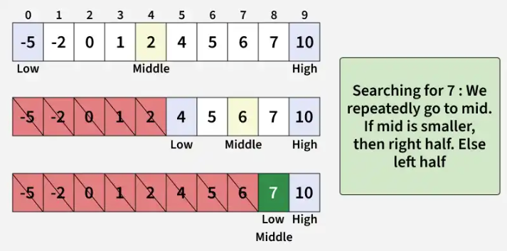

# Binary Search Algorithm

**Binary Search** is a searching algorithm that operates on a sorted or monotonic search space, repeatedly dividing it into halves to 
find a target value or optimal answer in logarithmic time **O(log N**.

The Binary Search algorithm can only be applied to data-structures that:
- are sorted,
- and access to any element of the data-structure takes constant time **O(1)**.

How does it work:
- Divide the data-structure into two halves by finding the middle index '`mid`'
- Compare the value at `mid` with the `key`
- If the `key` is equals to the value at `mid`, then terminate the process
- If the `key` is not found at the middle, choose which half hald will be used as the next search space.
    - If the `key` is smaller than the middle, then the `left` side is used for the next search.
    - If the `key` is larger than the middle, then the `right` side is used for the next search.
- This process is continues until the `key` is found or the total search space is exhausted.

## Complexity Analysis
- **Time Complexity**
    - Best Case: O(1)
    - Average Case: O(log N)
    - Worst Case: O(log N)
- **Auxiliary Space**:
    - Normal Implementation: O(1)
    - Recursive Implementation: O(log N)

## Applications
- Searching in sorted arrays
- Finding first/last occurrence or closest match in a sorted array
- Database indexing — Used in B-trees and similar structures for fast data lookup.
- File systems & libraries — Fast search through sorted directories or symbol tables.
- Machine learning tuning — Efficient hyperparameter search (e.g., learning rate, thresholds).
- Network routing & IP lookup — Efficiently find routing entries in tables sorted by address ranges.