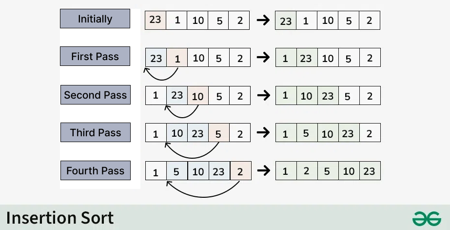

# Insertion Sort

Insertion Sort is a simple, comparison-based algorithm that builds a sorted list one element at a time.
It works similarly to the way most people instinctively sort a hand of playing cards - by picking up one card at a time and inserting it into its correct position relative to the cards already held.

The algorithm is classified as an in-place and stable sorting algorithm =, meaning it requires no additional memory proportional to the input size,
and it preserves the relative order of elements with equal keys.

Insertion Sort divides the input list into two conceptual parts:
- A sorted portion on the left, and
- An unsorted portion on the right.

At the start, the sorted portion contains only the first element, since a single element is trivially sorted.
The algorithm then proceeds through the following steps for each remaining element:
- The current element is picked from the unsorted portion - *this is called the key*.
- The key is compared against the elements in the sorted portion, moving from right to left.
- Any sorted element that is greater than the key is shifted one position to the right to make room.
- Once the correct position is found, the key is inserted there.
- This process repeats until all elements have been moved from the unsorted portion into the sorted portion.

By the time the algorithm reaches the last element, the entire list i guaranteed to be sorted.

## Interesting facts
- Insertion Sort is one of the few sorting algorithms that can sort a list as it receives it - it is an online algorithm, meaning it does not need all elements to be present before it begins sorting.
- Unlike Bubble Sort and [Selection Sort](../selectionsort/SelectionSort.md), Insertion Sort performs very well on nearly sorted data, achieving close to linear time (O(n)) is such cases.
- The algorithm is naturally adaptive - its performance improves the more sorted the input already is.
- Insertion Sort is stable, meaning two elements with equal values will retain their original relative order after sorting.
- It is widely used in education settings as an introduction to sorting due to its intuitive, step-by-step nature.

## Complexity Analysis
- Time Complexity
  - Best Case: O(n)
  - Average Case: O(n^2)
  - Worst Case: O(n^2)
- Auxiliary Space:
  - Best Case: O(1)
  - Average Case: O(1)
  - Worst Case: O(1)

## Advantages
- Simple to understand and implement, making it ideal for learning and teaching sorting concepts.
- Very efficient on small datasets, often outperforming more complex algorithms like [Quick Sort](../quicksort/QuickSort.md) or Merge Sort at small sizes.
- Performs exceptionally well o nearly sorter or partially sorted data due to its adaptive nature.
- In-place sorting requires no extra memory allocation, making it memory efficient.
- Stable sort preserves the original order of equal elements, which is important in certain use cases such as sorting records with multiple fields.
- Online algorithm - can sort data as it arrives without needing the full dataset upfront.

## Disadvantages
- Inefficient on large datasets due to its O(n^2) average and worst-case time complexity.
- Performance degrades significantly when the data is in reverse order, as every element must shift past all previously sorted elements.
- Not suitable as a general-purpose sorting algorithm for large-scale applications where performance is critical.
- Compared to divide-and-conquer algorithms like Merge Sort or [Quick Sort](../quicksort/QuickSort.md), ir does not scale well as input size grows.

## Applications
- Used as a subroutine in Bucket Sort
- Can be useful when array is already almost sorted
- Since Insertion sort is suitable for small sized arrays, it is used in Hybrid Sorting algorithms along with other efficient algorithms like [Quick Sort](../quicksort/QuickSort.md) and Merge Sort. When the subarray size becomes small, we switch to insertion sort in these recursive algorithms.
- Embedded Systems: In low-memory environments such as micro-controllers, Insertion Sort's in-place O(1) space requirement makes it a practical choice.