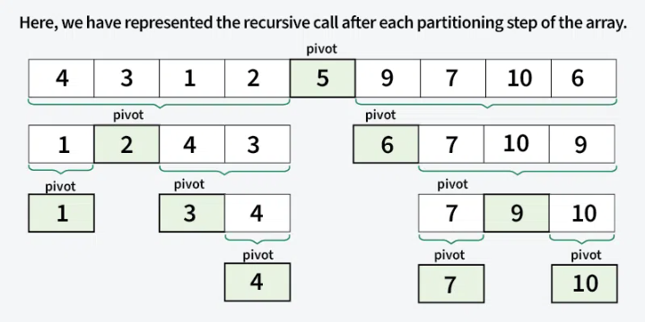

# Quick Sort Algorithm
**QuickSort** is a sorting algorithm based on the Divide and Conquer that picks an element as a pivot and partitions the given array around the picked pivot by placing the pivot in its correct position in the sorted array.

There are mainly three steps in the algorithm:

1. **Choose a Pivot:** Select an element from the array as the pivot. The choice of pivot can vary (e.g., first element, last element, random element, or median).
2. **Partition the Array:** Re arrange the array around the pivot. After partitioning, all elements smaller than the pivot will be on its left, and all elements greater than the pivot will be on its right.
3. **Recursively Call:** Recursively apply the same process to the two partitioned sub-arrays.
4. **Base Case:** The recursion stops when there is only one element left in the sub-array, as a single element is already sorted.


- Implementation: [QuickSort.java](./QuickSort.java)

## Partition Algorithm
The key process in quickSort is a partition() algorithm/function. There are three common algorithms to partition. All these algorithms have O(n) time complexity.
1. **Naive Partition**: Here we create copy of the array. First put all smaller elements and then all greater. Finally we copy the temporary array back to original array. This requires O(n) extra space.
2. **Lomuto Partition**: We have used this partition in this article. This is a simple algorithm, we keep track of index of smaller elements and keep swapping.
3. **Hoare's Partition**: This is the fastest of all. Here we traverse array from both sides and keep swapping greater element on left with smaller on right while the array is not partitioned.

The **Lomuto Partition** is the most simplest one of the 3, but in our [implementation](./QuickSort.java) we used **Hoare's Partition** because it is the fastest of them all.
It is documented below.

## Hoare's Algorithm
Given an array **arr[]**, that task is to *partition* the array by assuming first element as **pivot element**.
The partition of an array must satisfy the following two conditions:
- Elements smaller than pivot element must appear at index less than or equal to partition index.
- Elements larger than or equal to pivot element must appear at index greater than partition index.

Partition index is equal to count of elements, strictly smaller than pivot, minus one.

```text
Input: arr[] = [5, 3, 8, 4, 2, 7, 1, 10]
Output: [1, 3, 2, 4, 8, 7, 5, 10]
Explanation: The partition index is 3 and pivot element is 5, all elements smaller than pivot element [1, 3, 2, 4] were arranged before partition index and elements larger than or equal to pivot [8, 7, 5, 10] were arranged after partition index.

        Input: arr[] = [12, 10, 9, 16, 19, 9]
Output: [9, 10, 9, 16, 19, 12]
Explanation: The partition index is 2 and pivot element is 12, all elements smaller than pivot element [9, 10, 9] were arranged before or at partition index and elements larger than or equal to pivot [16, 19, 12] were arranged after partition index.
```

This partition algorithm performs in **O(n)** time and **O(1)** space.

Step-by-step execution of algorithm:
- Consider the first element as the pivot and initialise two pointers, i at the start and j at the end of the array.
- Move i to the right until an element greater than or equal to the pivot is found, and move j to the left until an element less than or equal to the pivot is found.
- If i points to an element greater than or equal to the pivot and j points to an element less than or equal to the pivot, swap them.
- Repeat the process, moving i and j toward each other until they meet or cross.
- When the pointers cross, the partitioning is complete, with elements less than or equal to the pivot on the left and those greater than or equal to the pivot on the right.

Interesting facts:
- Hoare's Partition Algorithm is generally faster than Lomuto's because it performs fewer swaps and makes only one traversal of the array, leading to better time complexity in practice.
- It works in-place and does not require extra space, unlike the naive partitioning method which uses a temporary array.
- It can be used to implement a stable version of Quick Sort with the right adjustments, though it is not inherently stable.
- We can easily modify the algorithm to consider the first element (or any other element) as pivot by swapping first and last elements and then using the same code.

## Choice of Pivot
There are many different methodologies for selecting a pivot.
- Always picking the first (or last) element as a pivot results in a problem where the approach ends up in the worst case scenario if the array is already sorted.
- Picking a random element as a pivot is the preferred approach because it does not have a pattern for which the worst case happens.
- Picking the median element as a pivot:
    - This is an ideal apprach in terms of time complexity as we can find median in linear time and the partition function will always divide the input array into two halves.
    - But it takes more time on average as median finding has high constants.

## Complexity Analysis
- Time Complexity:
    - Best Case: **_(Ω(n log n))_**, Occurs when the pivot element divides the array into two equal halves.
    - Average Case: **_(θ(n log n))_**, On average, the pivot divides the array into two parts, but not necessarily equal.
    - Worst Case: **_(O(n²))_**, Occurs when the smallest or largest element is always chosen as the pivot (e.g., sorted arrays).
- Auxiliary Space:
    - Worst Case: **_O(n)_** due to unbalanced partitioning leading to a skewed recursion tree requiring a call stack of size O(n).
    - Best Case: **_O(log n)_** as a result of balanced partitioning leading to a balanced recursion tree with a call stack of size O(log n).

## Advantages & Disadvantages
### Advantages
- It is a divide-and-conquer algorithm that makes it easier to solve problems.
- It is efficient on large data sets.
- It has a low overhead, as it only requires a small amount of memory to function.
- It is Cache Friendly as we work on the same array to sort and do not copy data to any auxiliary array.
- Fastest general purpose algorithm for large data when stability is not required.

### Disadvantages
- It has a worst-case time complexity of O(n2), which occurs when the pivot is chosen poorly.
- It is not a good choice for small data sets.
- It is not a stable sort, meaning that if two elements have the same key, their relative order will not be preserved in the sorted output in case of quick sort, because here we are swapping elements according to the pivot's position (without considering their original positions).

## Application of Quick Sort
- Sorting large datasets efficiently in memory.
- Used in library sort functions (like C++ std::sort and Java Arrays.sort for primitives).
- Arranging records in databases for faster searching.
- Preprocessing step in algorithms requiring sorted input (e.g., binary search, two-pointer techniques)
- Sorting arrays of objects based on multiple keys (custom comparators).
- Graphics and computational geometry (e.g., convex hull algorithms).