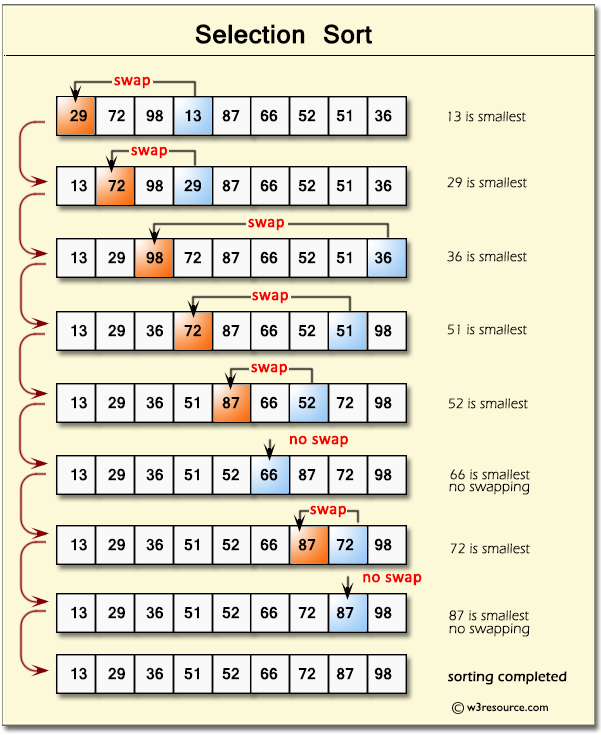

# Selection Sort Algorithm
**Selection Sort** is a comparison-based sorting algorithm. It sorts by repeatedly selecting the **smallest (or largest)** element from the unsorted portion and swapping it with the first unsorted element.
1. Find the smallest element and swap it with the first element. This way we get the smallest element at its correct position.
2. Then find the smallest among remaining elements (or second smallest) and swap it with the second element.
3. We keep doing this until we get all elements moved to correct position.

## Advantages of Selection Sort
- Easy to understand and implement, making it ideal for teaching basic sorting concepts.
- Requires only a constant O(1) extra memory space.
- It requires less number of swaps (or memory writes) compared to many other standard algorithms. Only cycle sort beats it in terms of memory writes. Therefore it can be simple algorithm choice when memory writes are costly.

## Disadvantages of Selection Sort
- Selection sort has a time complexity of **O(n^2)** makes it slower compared to algorithms like Quick Sort or Merge Sort.
- Does not consistently maintain the relative order of equal elements which means it is not stable.

## Complexity Analysis of Selection Sorty
- Time Complexity:
    - **O(n^2)**
- Auxiliary Space:
    - **O(1)**

## Applications of Selection Sort
- Perfect for teaching fundamental sorting mechanisms and algorithm design.
- Suitable for small lists where the overhead of more complex algorithms isn't justified and memory writing is costly as it requires less memory writes compared to other standard sorting algorithms.
- **Heap Sort** algorithm is based on Selection Sort.